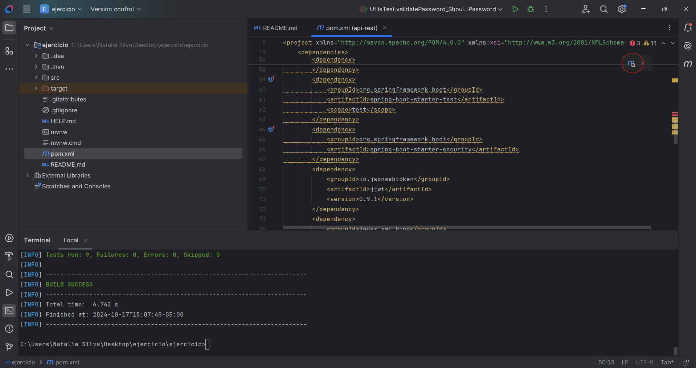
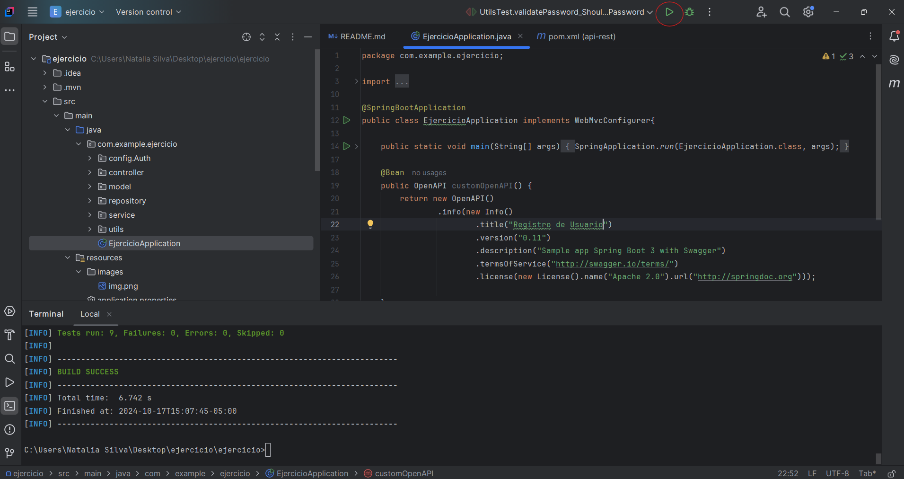
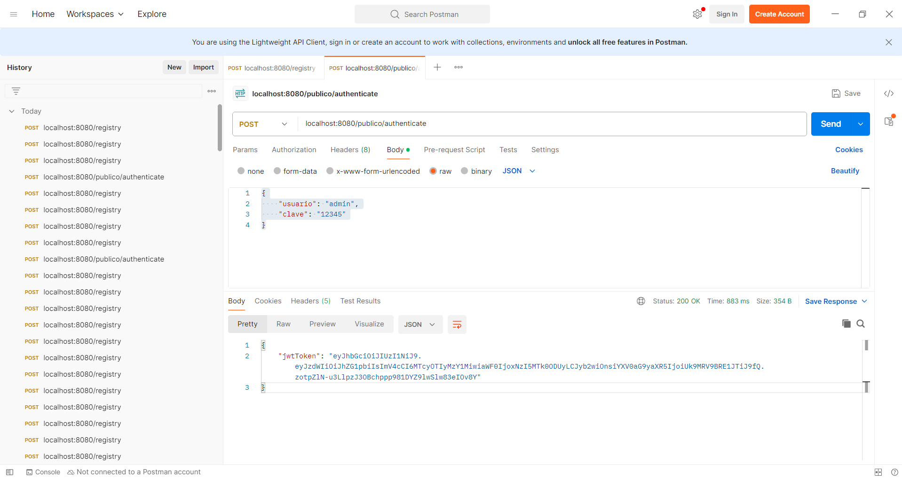
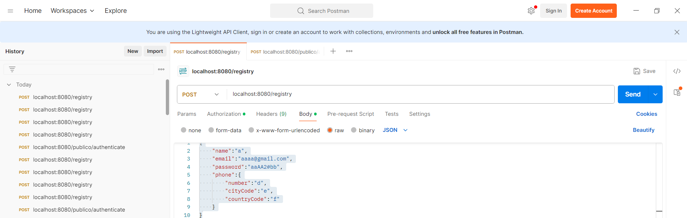
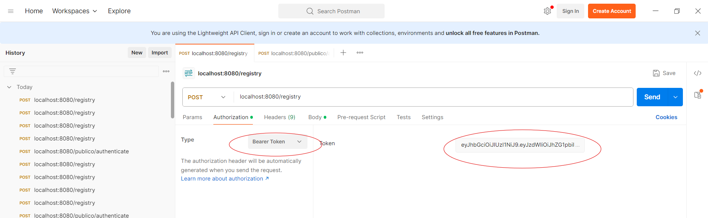
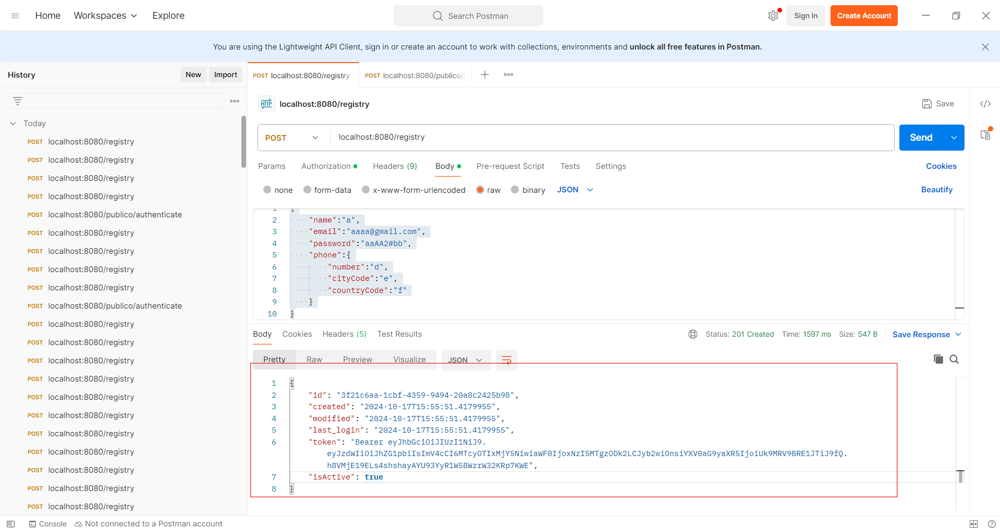
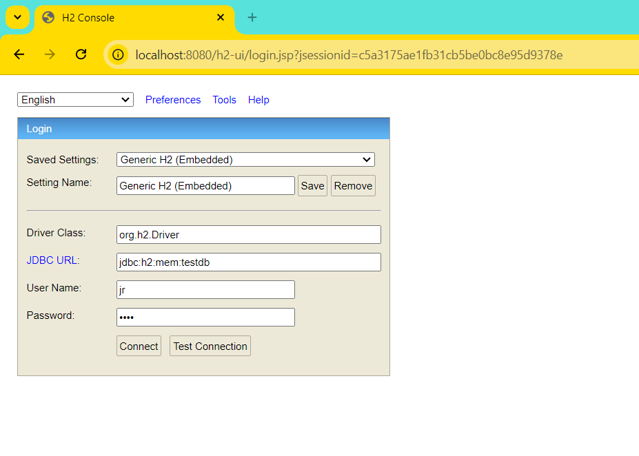
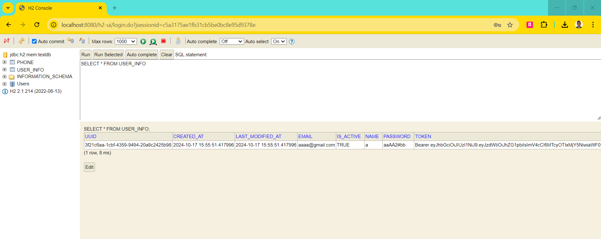
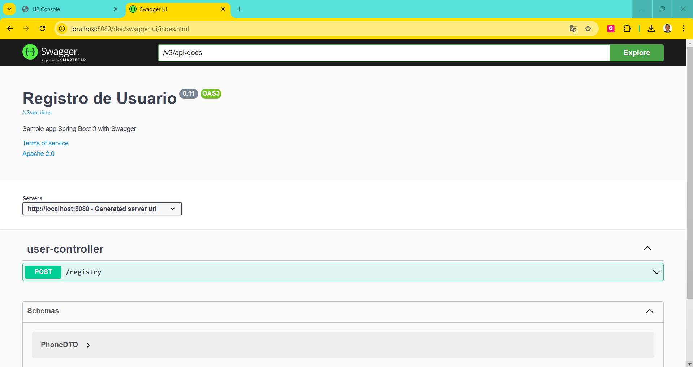

# Readme de prueba RegistroUsuarios

1. Descargar dependencias del Pom.xml mediante maven

2. Ejecutar el proyecto mediante el main (EjercicioApplication)

3. Configurar en postman la siguiente URL con el siguiente Request:

[POST] localhost:8080/publico/authenticate

{
"usuario": "admin",
"clave": "12345"
}

Y ejecutar la peticion para recibir el token de autenticacion

4. Configurar en postman la siguiente URL con la siguiente estructura de Request:

[POST] localhost:8080/registry

{
"name":"a",
"email":"aaaa@gmail.com",
"password":"aaAA2#bb",
"phone":{
"number":"d",
"cityCode":"e",
"countryCode":"f"
}
}

5. En la pestaña "Authorization" seleccionar "Type":"Bearer Token" e insertar e token que recibimos al ejecutar el punto 3

6. ¡Listo! Ya podemos ejecutar el servicio para comprobar las distintas restricciones

- PostData: No es necesario ejecutar ningun Script de base de datos, debido a que las librerias generan las tablas con base a las entidades configuradas por defecto. 

# Base de datos H2

1. Para comprobar la insercion de datos en la base de datos H2, ingresamos a la siguiente URL:
 -  localhost:8080/h2-ui

Configurando los siguientes parametros 

(Password: aaaa)

2. Despues de insertar un usuario por medio de Postman, hacemos un select a la tabla "User_info" para verificar

# URL Swagger

1. Para verificar el swagger, ingresamos a la siguiente URL:
- http://localhost:8080/doc/swagger-ui/index.html

